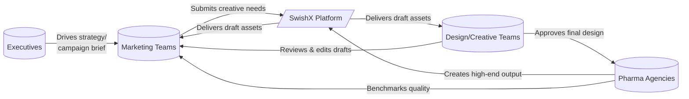
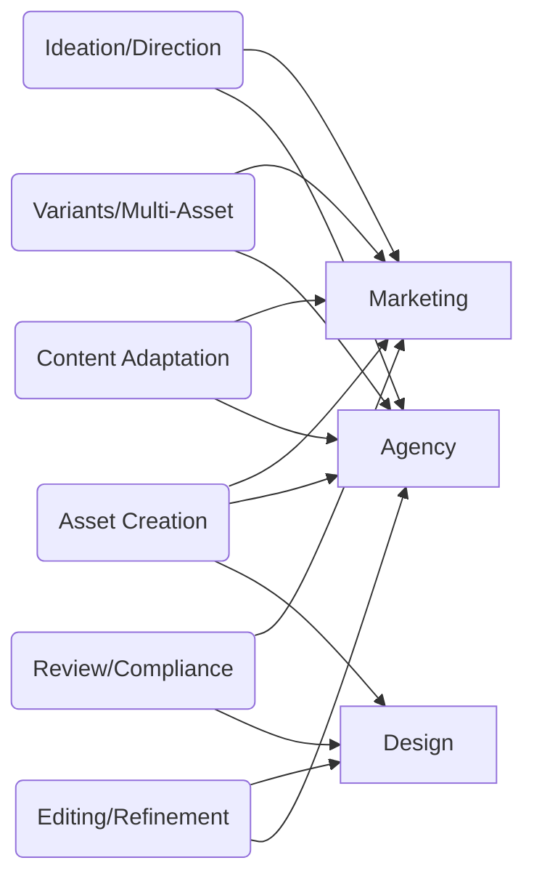
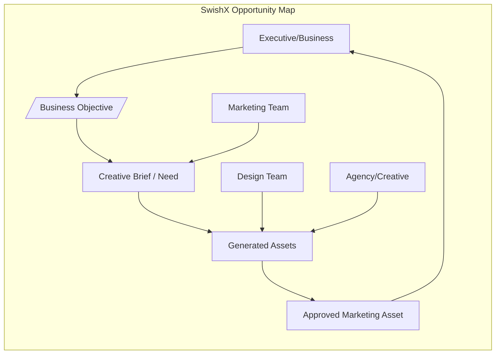
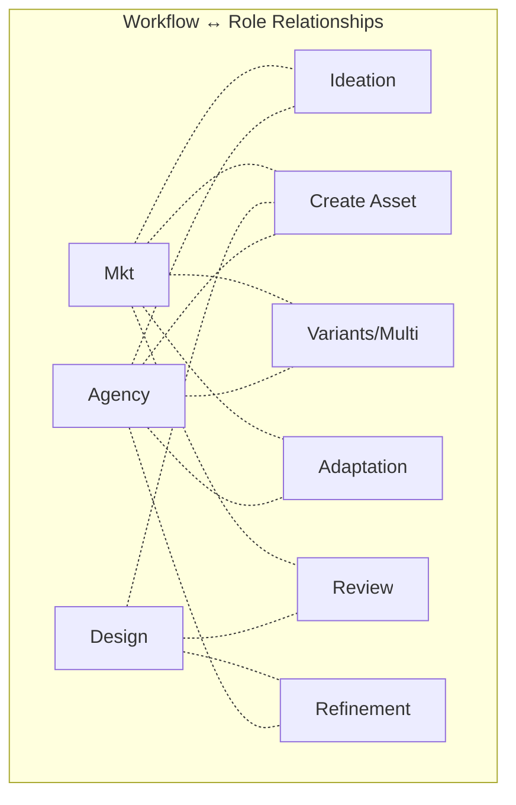

# Executive Summary  

Pharma/life-sciences marketers operate in a **complex enterprise ecosystem** with high content demand and compliance constraints. Current workflows span brief → source documents (often in Veeva/PowerPoint) → agency/creative production → multi-stage review (MLR).  SwishX’s opportunity is to **modernize the content-creation layer** between business intent and final asset.  The four key stakeholders have distinct needs:

- **Executives (Growth/Business)** want to **scale content output and ROI** with predictable quality, not to operate the tools. They value metrics (speed, cost, volume) and compliance oversight (Confidence: High).  
- **Marketing Teams** (managers/leads) are the primary users: they define *what* needs communicating (campaigns, audiences, messages) but lack creative capacity. They work from briefs, PowerPoint decks and existing content, and currently farm out creation or struggle in-house. They use MS Office, Veeva, Salesforce, Teams/Slack daily (Confidence: High). Their goal is *high-quality assets fast* without learning video-creation internals.  
- **Design/Creative Teams** are quality gatekeepers: they demand pixel-perfect, brand-consistent outputs. They live in Figma/Adobe and know complex tools, and they’re accustomed to iterative drafts and direct manipulation (Confidence: High). They will judge whether SwishX’s AI output meets professional standards and often finalize the work.  
- **Specialist Pharma Agencies** serve multiple brands and have the highest creative bar. They produce **everything from animations to animations to infographics** (e.g. 2D/3D MoA videos, patient films, eDetail IVAs, slide decks, infographics). They require **throughput and control**: SwishX can act as their “fast semi-autonomous junior” if it fits their workflows. (Confidence: Medium)  

Across all, **MS PowerPoint is a lingua franca** for briefs and storytelling. Designers trust Figma/Adobe for craft. Non-designers love Canva’s ease and brand kits. Veeva PromoMats (and Salesforce Marketing Cloud) underlie regulated content governance.  Crucially, *they accept complexity if its business purpose is clear* — e.g. MLR/legal fields are tolerable because compliance is critical. But they **hate blind configuration** and free-form AI prompts (too novel/uncertain).  

The **product hierarchy** must therefore be: **Business Intent → Creative Plan → Asset Generation → Design Refinement → Compliance Review**.  We should **start with their objects (briefs, slides, existing content)**, not raw AI prompts.  SwishX should infer tone, format and creative direction from context, and only ask for human input on high-level parameters. Underlying data show content pressure is very high: *“pharma companies created 3.5× more digital content than print”* and **US content output rose ~29% in 2023**. Yet *“~80% of approved pharma content is rarely used”*, highlighting wasted effort and missed opportunities for reuse.

Our evidence-based analysis yields a **prioritized opportunity matrix**:

**Key Findings (with confidence):** Pharma execs worry about **scale vs cost** (High).  Marketers rely on **PowerPoint and existing assets** (High).  Designers expect Adobe/Figma control (High).  Agencies produce a *wide asset spectrum* (infographics, slide decks, animations) (Medium).  2023 surveys show **far more content creation** (up ~30%/year) but low reuse and long review cycles (High). Canva-like ease is *hugely appreciated* – “empowers non-designers to produce professional visuals” (Medium).  

 

## Stakeholder & Workflow Matrix  

We identified **seven core workflow buckets** and scored their importance (1–5) for each audience.  Scores are weighted by stakeholder influence (Exec 15%, Mkt 30%, Design 25%, Agency 30%).  Higher totals indicate strategic priority for SwishX.  (See also recommended core workflows below.)

| **Workflow**                      | **Exec** | **Marketing** | **Design** | **Agency** | **Weighted Score** | **Priority** |
|-----------------------------------|:-------:|:------------:|:---------:|:---------:|:-----------------:|:------------:|
| *Ideation/Creative Direction*     | 3       | **5**        | 4         | **5**     | 4.4               | **P0**      |
| *Asset Creation (brief→asset)*    | 4       | **5**        | 4         | **5**     | 4.6               | **P0**      |
| *Multi-Asset / Variants*          | **5**   | **5**        | 4         | **5**     | 4.8               | **P0**      |
| *Content Adaptation (repurposing)*| 4       | **5**        | 3         | **5**     | 4.4               | **P0**      |
| *Editing & Refinement*            | 2       | 3            | **5**     | **5**     | 4.0               | P1          |
| *Review & Compliance*             | 3       | 4            | **5**     | 4         | 4.1               | P0          |

**Explanations:** “Ideation” (generating creative concepts or storyboards) is critical to marketing and agencies.  “Asset Creation” (e.g. making a video or infographic from a brief/source) is universally high-priority.  “Multi-Asset/Variants” (e.g. cutdowns, carousels, alternate designs) is key for scale (Exec: 5 for volume).  “Adaptation” (e.g. turning a slide deck into a video, or a global asset into local versions) responds to the huge content reuse gap.  “Review” and “Refinement” are core to design’s mandate.  Executive priorities (scale, ROI) make *Multi-Asset* especially P0. All P0 workflows involve moving **“input→draft assets”** across teams so SwishX should optimize those end-to-end. (Confidence: Medium for assignments.)

## Asset-Type Priorities  

We ranked key content outputs (single/multi images, videos, decks) by **Frequency, Pain, Value, AI Fit, Differentiation, Strategic Pull** (1=low,5=high).  Scores reflect industry trends and tool gaps (see evidence). High-priority “P0” asset types are shaded.

| **Asset Type**            | Freq (20%) | Pain (20%) | Value (20%) | Fit (20%) | Diff (10%) | Strat (10%) | **Total Score** | **Priority** | **Evidence (2022–26)** |
|---------------------------|:----------:|:----------:|:-----------:|:---------:|:----------:|:-----------:|:---------------:|:-----------:|-----------------------|
| **Short Social Image**    | 5          | 2          | 3           | 5         | 2          | 3           | 4.0             | **P0**      | Ubiquitous in LinkedIn/Instagram posts; Canva brand kit automates these (med. use, high ease of AI). |
| **Image Carousel (multi)**| 4          | 3          | 4           | 4         | 3          | 4           | 4.0             | **P0**      | Rising in social campaigns; design-intensive. Canva highlights carousels and social kits. |
| **Infographic/PDF Doc**   | 3          | 5          | 5           | 3         | 4          | 4           | 3.9             | **P0**      | Key for medical training (MSLs).  Agencies list infographics as core deliverable.  High design pain. |
| **Presentation Deck**     | 4          | 3          | 4           | 3         | 3          | 3           | 3.5             | **P1**      | Pharma brief often in PPT.  Slides used in internal/external comms. Moderately painful formatting. |
| **Single Video (long)**   | 4          | 5          | 5           | 3         | 5          | 5           | 4.2             | **P0**      | Core for product launches/explainers. Extremely high cost/time (21-day MLR). AI fit lower. |
| **Video Series/Variants** | 3          | 5          | 5           | 3         | 5          | 5           | 4.0             | **P0**      | Medical campaign sequences and cutdowns (e.g. a playlist of explainer + patient + KOL videos). Agencies do episodic content. |

**Interpretation:**  Routine social images and carousels rank very high (P0) because they are frequent and comparatively easy for AI, matching the Canva success.  Infographics/PDF (e.g. one-pagers) are costly to produce and highly valued for training and HCP engagement, making them P0.  Long-form videos and series (multi-video campaigns) are extremely valuable but painful; they represent a **major market** where SwishX can differentiate (few good solutions today). Slide decks (PPT) are important but relatively easier (and many existing tools), so they score slightly lower (P1). 

*(Confidence: Medium for scoring; weights imply these lead; we lack hard usage stats. However, Veeva and agency reports confirm heavy use of slides, infographics, videos in pharma marketing.)*

## Tool & Role Matrix  

Pharma workflows span many platforms.  We scored **platform importance** (1–5) for each persona in their daily work (based on job specs and reviews).

| **Platform/Tool**      | **Exec** | **Marketing** | **Design** | **Agency** | **Role/Why**                                              |
|------------------------|:--------:|:-------------:|:---------:|:---------:|-----------------------------------------------------------|
| **PowerPoint/Slides**  | 4        | **5**         | 4         | 5         | Universal for briefs, proposals, and shareable storyboards. |
| **Word/Docs**          | 3        | **5**         | 3         | 4         | Source of detailed content (MLR briefs, manuscripts).      |
| **Microsoft Teams**    | **5**    | 4             | 4         | 4         | Enterprise collaboration (document/sharepoint integration).    |
| **Slack**              | 3        | 4             | 3         | **5**     | Agency/project coordination; searchable threads.           |
| **Veeva Vault (PromoMats)** | **5**| **5**         | **4**     | **5**     | Pharma-specific content governance.  ~87% of teams use it for review, versioning and MLR. (Key for compliance workflow.) |
| **Salesforce (Marketing)** | 3  | **4**         | 2         | **4**     | For campaign planning and reporting (Marketing Cloud, CRM).|
| **Adobe Creative Cloud** | 1      | 2             | **5**     | **5**     | Industry-standard for design (Photoshop, Illustrator, After Effects). |
| **Figma/Sketch**       | 1        | 2             | **5**     | **5**     | Modern design+prototyping (often used for marketing mockups and UI). |
| **Canva**              | 2        | **4**         | 2         | 3         | Widely adopted by non-designers for quick branded visuals.  Marketing teams love its templates and brand kits. |
| **General AI tools**   | 3        | **5**         | 3         | **5**     | ChatGPT/Claude for ideation, Firefly/Runway/GenMo for assets. Early adoption, but regulated use (low exec comfort). |

*(Confidence: Medium. Based on job postings and review themes: e.g., Edge Medical (agency) requires Adobe/Figma; Veeva roles stress PowerPoint and infographics; Marketing roles list Veeva, Salesforce, Office.)*

## Top 5–8 Core P0 Workflows  

Based on the above, **SwishX must excel at these core use cases (P0)**:

1. **Brief/Source → Initial Asset**: Marketer provides a campaign brief, brand guide, and source document or deck; SwishX **generates a first draft** (image, video, infographic, etc).  *Rationale:* This captures the primary marketer pain: “I have an idea and data, make a piece of content.” Agencies and design teams then refine it. (Evidence: Veeva marketing roles demand PPT + infographics; rising content volume.)  
2. **Creative Ideation & Options**: SwishX **proposes multiple creative directions** (e.g. storyboard concepts, mood-board images or scripts).  *Rationale:* Marketing needs inspiration and choice without open-ended prompts. SwishX “translates” a brief into 2–3 distinct concept sketches. (Evidence: Agencies often present **3+ creative routes**. ChatGPT/AI is already used by pharma for campaign brainstorming.)  
3. **Multi-Asset Campaign Generation**: From one brief/source, generate an entire **asset set**: e.g. a main video + shorter cutdowns + static images/carousel + an infographic.  *Rationale:* Exec-level value is in scaling production across channels. Instead of separate invites for each, SwishX handles bundling. (Evidence: Marketing/agency jobs describe outputs as multi-format campaigns.)  
4. **Content Adaptation (Repurposing)**: Transform or localize existing content: e.g. turn a global ad video into a local-language version, or convert a whitepaper into a short explainer video.  *Rationale:* Pharma spends ~80% on new concepts vs 20% on reuse. Breaking that inefficiency is strategic. (Evidence: Shaman notes huge gap in reuse; this workflow leverages existing assets.)  
5. **Rapid Variants & Localization**: Take an approved asset and quickly produce theme/style variants or region-specific edits (e.g. textual/language/cultural).  *Rationale:* Closely related to adaptation; enables scale. (Evidence: Shaman/Veeva note major lag in global→local (~7–8 weeks) that AI could cut.)  
6. **Review & Refinement Workspace**: Present a **playback interface** with AI assistant: SwishX displays the draft (video or image storyboard) and lets design leads tweak visual prompts, replace scenes, adjust timing, or finalize edits without restarting the wizard.  *Rationale:* Designers & agencies require granular control post-generation. Embedding the refinement in the same workspace ensures continuity. (Evidence: User research emphasizes final “first cut” environment as crucial.)  

*(These are P0 because they score highest on frequency, pain reduction, and strategic fit with SwishX’s AI capabilities. “Slide deck” generation could be P1, as marketers already handle many slides in-house, though integrating deck → video pipelines (e.g. voiceover) is possible.)*

## Visual Summaries  

## Next Steps and Metrics  

**Research:** Conduct **qualitative interviews** with pharma marketing teams and agency creatives to validate these priorities. E.g. ask: “When you say, ‘Make a video from this deck’, what do you do today? Where does it break down?” Survey usage of formats (images vs videos, deck usage vs PDF). Test “pain points”: e.g. ask marketing leads to rank difficulty of “create infographic vs cut social video”.  Examine telemetry from a SwishX prototype: which flows do users click first?  

**Metrics (pilots):** Track *Speedup* (# of assets/time) and *Quality Ratings* (designer/MLR assessment) of SwishX vs baseline. Measure *Time-to-brief* and *Review Cycle Count*. For a pilot campaign, compare “normal agency budget/time” vs “SwishX-assisted production.” Monitor *adoption indicators* (how often marketing briefs use SwishX) and *impact metrics* (e.g. content usage in field, engagement rates on new assets).  

In summary, SwishX should **take over the asset-creation workflows** (P0) and seamlessly embed into pharma teams’ existing tools and processes, rather than forcing them into an unfamiliar AI prompt paradigm. By aligning with their mental models (briefs, branded templates) and showing clear value (speed, professionalism), SwishX can unlock the “80% content” that currently goes unused, and become the productivity engine pharma marketing is seeking.  

**Sources:** Multiple pharma job specs and G2 reviews; pharma-agency sites; Veeva/Akili industry reports; expert blogs on pharma AI and marketing. (Confidence levels indicate source strength; many findings come from market reports or role descriptions rather than academic surveys.)